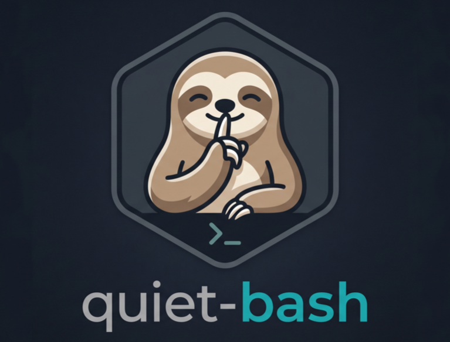
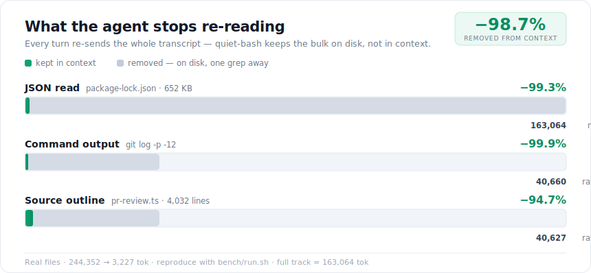
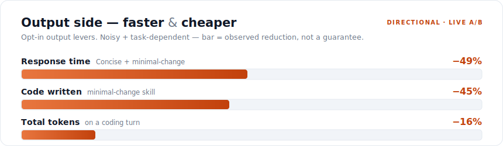
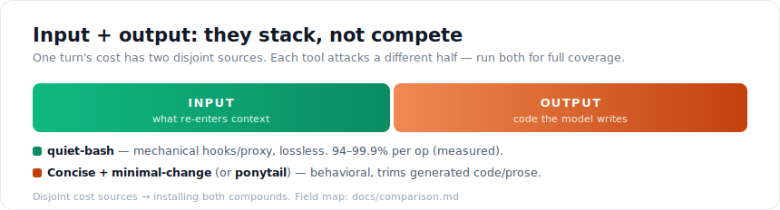

<p align="center">
  
</p>

<p align="center">
  <em>Stop paying to re-read build logs your agent already skimmed.</em>
</p>

<p align="center">
  
  
  
  
  
</p>

<p align="center">
  <a href="#quickstart">Quickstart</a> ·
  <a href="#how-much-it-saves">Savings</a> ·
  <a href="#supported-agents">Agents</a> ·
  <a href="#install">Install</a> ·
  <a href="docs/comparison.md">Comparison</a> ·
  <a href="examples/before-after.md">Examples</a> ·
  <a href="LICENSE">MIT</a>
</p>

---

**quiet-bash** keeps the bulky text an AI coding agent doesn't need to re-read out of
its context window — **losslessly**. An agent is stateless, so every turn re-sends the
whole transcript; a 600-line test log near the start of a task is re-billed on every
later turn. quiet-bash spills that text to disk (byte-exact, one `jq`/`grep`/`Read` away)
and leaves a short summary in its place — so you stop paying to re-send what the agent
already read.

It quiets the **four things that bloat an agent's context**:

| What | Without quiet-bash | With quiet-bash |
|---|---|---|
| **Verbose commands** — tests, builds, CI, `docker`/`bazel`, big `git diff` | thousands of log lines | one `[ok: …]` line · failure → cleaned tail |
| **Large file reads** — `package-lock.json`, a 3,000-line source file | the whole file dumped | value-folded JSON/YAML preview or a signature outline |
| **Large tool results** — MCP, `WebFetch`/`WebSearch`, API payloads | the whole payload | spilled + a collapsed preview |
| **Long injected prompts** — big `CLAUDE.md`/`AGENTS.md`, hook prompts | re-sent in full every turn | a short stub; reference loads on demand |
| **Read-to-find work** — locating, counting, extracting, verifying over files/logs | model reads the haystack into context | `deterministic-first` skill + `quiet-verify`/`quiet-agg` return just the answer |
| **Repeated & blocking work** — re-reading unchanged files, judging logs, polling | model re-reads / re-judges / re-polls every turn | dedup of unchanged re-reads · `quiet-check` verdict+tally · `quiet-wait` one-shot poll |
| **Lookups & archaeology** — config values, git history, recursive search | model reads whole files / scrolls full logs / floods on `grep -r` | `quiet-conf` · `quiet-hist`/`quiet-blame` · recursive `grep`/`rg` auto-collapsed |

## Highlights

- **Measured, reproducible savings** — command output **−99.9%**, JSON **−99.3%**, source outline **−94.7%** on real files (run [`bench/run.sh`](bench/run.sh) yourself). A separate model-economy gate ([`bench/model-economy.sh`](bench/model-economy.sh)) measures whether downgrading subagents to a cheaper tier saves cost with zero answer-quality regression.
- **Lossless** — the full output stays byte-exact on disk, one `jq` / `grep` / `Read`-range away. Nothing is hidden on failure (you still get the cleaned error tail).
- **Works with 8 agents** — Claude Code · Codex · Gemini · Copilot · Cursor · Aider · OpenCode · or any shell (via PATH shims / wrapper).
- **Zero dependencies** — just `bash` + `jq`. No daemon, no model, no network call.
- **Output side too** *(opt-in)* — a `Concise` style plus `minimal-change` (code) and `minimal-docs` (markdown) skills trim generated tokens; stacks with [ponytail](https://github.com/DietrichGebert/ponytail).

## Quickstart

Claude Code — this repo is a single-plugin marketplace:

```sh
/plugin marketplace add yoeld-wix/quiet-bash
/plugin install quiet-bash@quiet-bash
```

Restart Claude Code and you're done. For Codex, Gemini, Copilot, OpenCode, or any
shell, see **[Install](#install)**.

## Contents

- [How much it saves](#how-much-it-saves)
- [What it covers](#what-it-covers)
- [Features in depth](#features-in-depth)
  - [Large JSON & YAML reads](#large-json--yaml-reads)
  - [Querying spilled data (`quiet-query`)](#querying-spilled-data-quiet-query)
  - [Large source files (outlining)](#large-source-files-outlining)
  - [Large tool results (MCP, WebFetch, WebSearch)](#large-tool-results-mcp-webfetch-websearch)
  - [Output side: `Concise` style](#output-side-concise-style)
  - [Output side: `minimal-change` skill](#output-side-minimal-change-skill)
  - [Output side: `minimal-docs` skill](#output-side-minimal-docs-skill)
  - [Prompt quieting (`quiet-prompt`)](#prompt-quieting-quiet-prompt)
- [Supported agents](#supported-agents)
- [Install](#install)
- [Configuration](#configuration)
- [Requirements](#requirements)
- [How it works](#how-it-works)
- [Benchmark](#benchmark)
- [FAQ](#faq)
- [License](#license)

## How much it saves

<p align="center">
  <picture>
    <source media="(prefers-color-scheme: dark)" srcset="assets/reductions-by-layer-dark.svg">
    
  </picture>
</p>

> **On real inputs from a 543-commit production monorepo, quiet-bash cuts the three
> biggest context sinks by 94–99.9% each — a combined `244,352` → `3,227` tokens
> (`98.7%`). Every number here is reproducible: run [`bench/run.sh`](bench/run.sh).**

| Layer (real input) | Without | With quiet-bash | Reduction |
|---|--:|--:|--:|
| Command output · `git log -p -12` | 40,660 tok | 21 tok | **99.9%** |
| Large JSON read · `package-lock.json` (652 KB) | 163,064 tok | 1,062 tok | **99.3%** |
| Source outline · `pr-review.ts` (4,032 lines) | 40,627 tok | 2,144 tok | **94.7%** |

<sub>Measured by [`bench/run.sh`](bench/run.sh) on real files; token estimate ≈ bytes ÷ 4.
Full output in [`bench/RESULTS.md`](bench/RESULTS.md). A successful command's summary is a
fixed one-line `[ok: …]` (~20 tok) regardless of log size. Outline savings depend on the
body/signature ratio — **~95%** on logic-heavy files, **~78%** on a generated
all-signature `.d.ts`; both are real, the difference is the input.</sub>

### Bottom line on a real session — measured, not modeled

We measured this on **136 real agent sessions** with
[`bench/session-savings.py`](bench/session-savings.py) (it scans your own Claude Code
transcripts) instead of assuming a number. How much of each session's context was large
tool output quiet-bash collapses:

| Across 136 real sessions | Share of context that's collapsible large output |
|---|--:|
| **Pooled (all bytes)** | **13.7 %** |
| Median session | **0 %** |
| Mean session | 9.7 % |
| p90 — log/build-heavy session | **30.6 %** |

The honest read: **payoff scales with how log/build/read-heavy your work is.** Half of
sessions have little large output (median 0 %) — light editing barely benefits — while
CI-debugging and test-loop sessions hit 30 %+. This is a **conservative floor**: it
counts each output once, but an agent is stateless and **re-sends it every later turn**,
so the actual token-bill saving runs higher — and for the operations that *do* fire, the
cut is the measured **94–99.9 %** above. Reproduce on your own history: `bench/session-savings.py`.

### Live agent A/B — does it actually lower the bill?

We also ran a real headless Claude Code benchmark ([`bench/agentic-long.sh`](bench/agentic-long.sh),
Haiku 4.5, **n=4**): one long task driving **10 sequential verbose commands across ~11 turns**,
with vs without quiet-bash, measuring the real cumulative input tokens and cost.

| arm | cumulative input | cost |
|---|--:|--:|
| baseline | 74,121 tok | $0.178 |
| quiet-bash | 68,199 tok | $0.152 |

**~8 % fewer input tokens, ~6–15 % lower cost** — modest, real, and *noisy* (one run was a wash;
input is the steadier estimate). On **short** tasks it's ~flat: the fixed system-prompt + tool +
`CLAUDE.md` overhead dominates and there aren't enough turns to compound, and Claude Code already
truncates huge tool output. The honest takeaway: **quiet-bash's cut is huge per-operation (94–99.9 %)
but single-digit-to-low-double-digit per session, concentrated in long, log-heavy work.** Not a 30 %+
across-the-board win.

> ⚠️ This benchmark also caught a real bug: quiet-bash's command rewrite was a **no-op on Claude
> Code v2.1.x** until **v1.22.1** (Claude Code drops a PreToolUse `updatedInput` unless the hook also
> returns `permissionDecision: "allow"`). All numbers here are post-fix.

### Output side too — faster *and* cheaper (measured A/B)

<p align="center">
  <picture>
    <source media="(prefers-color-scheme: dark)" srcset="assets/output-savings-dark.svg">
    
  </picture>
</p>

The hooks cut **input**. Three opt-in guidance pieces cut **output** — the half priced
**3–5×** input and generated **serially** (the latency bottleneck). Measured in
subagent A/Bs:

| Lever | Effect | No regression? |
|---|--:|---|
| `Concise` output style | **~10% faster**, ~10–15% less output | content preserved |
| `minimal-change` skill | **~45% less code** | correctness preserved |
| `minimal-docs` skill | **~51% fewer rows, ~43% fewer output tokens** | required detail retained, clarity improved |
| **Both, on a coding turn** | **~30% → ~49% faster, ~16% fewer tokens** | suppresses scope-creep |

<sub>Input cuts are measured + reproducible ([`bench/run.sh`](bench/run.sh)). These
output-side figures are from **live subagent A/Bs** — noisy and task-dependent, so treat
them as **directional**; the ~45%-less-code gain needs a scope-creep-prone task to appear
(see [Benchmark](#benchmark) honesty notes). Session-level saving is **measured** at
~14% pooled (median 0%, p90 31%) across 136 real sessions — see Bottom line.</sub>

<details>
<summary><strong>Why it compounds over a session</strong> (the stateless-agent math)</summary>

An LLM agent is **stateless**: on *every* turn the whole conversation so far —
including all previous command output — is re-sent as input tokens. A log isn't paid
for once when it's produced; it's re-paid on every later turn it stays in context.

So a 600-line `yarn test` dump near the start of a 40-step task isn't a one-time cost
— it's **~600 lines × every turn that follows**. quiet-bash turns that dump into a
single `[ok: exit 0 — 612 lines hidden in …]` line that never enters context, so you
stop re-paying for it:

| Session | Verbose cmds | Log tokens re-sent **without** | **with** quiet-bash |
|---|--:|--:|--:|
| 10 turns | 4 | ~1.1M | ~500 |
| 25 turns | 10 | ~6.7M | ~3k |
| 40 turns | 16 | ~17.2M | ~8k |

<sub>Illustrative model: ~40% of turns run a verbose command, each resident for ~half
the remaining session, avg ~53.7k tokens/log. Real numbers depend on how log-heavy
your work is — but the direction and order of magnitude hold.</sub>

It also **keeps the prompt-cache prefix stable** (fewer giant, varying tool results →
more context stays cached) and **preserves debuggability** — on failure it still
surfaces the last 40 lines inline, and small `git diff`/`show`/`log` shows as normal.

</details>

### vs ponytail — they stack, not compete

<p align="center">
  <picture>
    <source media="(prefers-color-scheme: dark)" srcset="assets/stack-coverage-dark.svg">
    
  </picture>
</p>

| | quiet-bash | [ponytail](https://github.com/DietrichGebert/ponytail) |
|---|---|---|
| Attacks | **input** (what re-enters context) | **output** (code the model writes) |
| Mechanism | mechanical hooks/proxy — **lossless** | behavioral rules/prompt |
| Savings | 90–99.9% per op *(measured)*, ~14% pooled session *(measured, 136 sessions)* | ~54% less code, ~20% cost, ~27% time *(their benchmark)* |
| Best for | log/read-heavy sessions | code-generation-heavy sessions |

Disjoint cost sources → **run both for full input + output coverage.** Full field
map: [Comparison](docs/comparison.md).

## What it covers

| Command shape | Behaviour |
|---|---|
| **JS/TS:** `yarn`/`npm`/`pnpm`/`bun` (test/build/lint/install/add/ci/run/dev/start…), `npx …`, `jest`, `vitest`, `mocha`, `cypress`, `playwright`, `tsc`, `eslint`, `prettier`, `webpack`, `vite`, `rollup`, `esbuild`, `turbo`, `gulp`, `grunt` | Success → one summary line, output hidden. Failure → last 40 lines + log path. |
| **Python:** `pip install`, `pipenv`, `poetry`, `uv`, `conda`, `python -m …`, `python setup.py`, `pytest`, `tox`, `nox` | same |
| **JVM/Scala:** `gradle`/`gradlew`, `mvn`/`mvnw`/`maven`, `sbt`, `bloop`, `bazel`, `buildozer` | same |
| **Go / Rust / Ruby / C:** `go test/build/install/vet/mod/get/run`, `cargo`, `bundle`, `gem install`, `rake`, `rspec`, `make`, `cmake`, `ninja` | same |
| **Containers / CI:** `docker build`, `docker compose`/`docker-compose`, `bk`/`buildkite` | same |
| `git diff` / `git show` / `git log` (without a limiting flag, pipe, or redirect) | ≤60 lines → shown inline. Larger → `--stat`/`--oneline` summary + log path. Failure → tail. |
| **Large `*.json` / `*.yaml` reads** (`cat`/`bat`/`head`/`jq .`/`yq .` of a file > 25 KB) | Collapsed preview: repeated object/array shapes fold to `"N more of M, same shape"`, long strings truncated, + a `jq`/`yq` drill-in footer. File untouched on disk. |
| **Large source files** (`cat`/`Read` of a `.py`/`.ts`/`.go`/`.rs`/`.java`/`.rb`/`.c`/… file > 30 KB) | Signature outline: imports + class/function/method signatures with bodies elided, each with the exact line range to expand (`Read <file> offset=S limit=N`). File untouched on disk. < 3 symbols → falls back to head/tail. |
| **`gh` CI logs / PR diffs** (`gh run view … --log`, `gh pr diff`) | Full output spilled; head+tail preview + grep pointer. Content preserved on disk. Piped/redirected/`$(…)` forms pass through. |
| **Recursive listings** (`ls -R`, `tree`, `find <path>`) | > 60 lines → first 40 + count + log path; full listing on disk. `find -exec`/`$(…)` and `grep`/`rg` left alone. |
| **`curl` responses** (`curl <url>`, not `-o`/`-I`/piped/`$(…)`) | > 25 KB → JSON collapses via the JSON preview (handles minified), else head+tail + log path. Small responses inline. Full body on disk. |
| everything else (`ls`, `cat`, `grep`, `git status`, small `gh …`, …) | Passed through unchanged. |

Already-bounded commands (those with `--stat`, `--oneline`, a pipe to `head`/`grep`/…,
or a `>` redirect) are left alone, and the hook never double-wraps its own output or a
follow-up read of a log file.

## Features in depth

### Large JSON & YAML reads

`cat`-ing a big `package-lock.json`, `openapi.json`, `pnpm-lock.yaml`, or a k8s bundle
dumps tens of thousands of tokens the agent mostly skims. quiet-bash rewrites a large
`*.json`/`*.yaml` read into a **collapsed preview** — repeated object/array shapes fold
to one sample plus `"N more of M, same shape"` (so keys aren't repeated hundreds of
times), long strings truncate, and a footer prints the exact `jq`/`yq` to query the
full file (untouched on disk). A real `package-lock.json` went from **~299,000 tokens →
~660** (−99.8%); a 50-doc k8s manifest bundle collapses to its first few docs + a count.

YAML is converted to JSON with the first available of **`ruby` → `python3`+PyYAML →
`yq`** (Ruby ships `yaml`+`json` in its stdlib, so this works out of the box on macOS
and most CI); if none is present, YAML passes through untouched. Multi-doc YAML becomes
an array; comments are dropped in conversion (fine for a summary).

The collapsed-preview format was chosen over gron-flat and schema-only by an A/B/C
benchmark measuring **tokens *and* answer accuracy**: collapsed used the fewest tokens,
matched gron on accuracy, and produced **zero hallucinated values** — when a value is
elided, the agent correctly defers to the file rather than guessing. (`schema-only` was
disqualified: it can't compress objects keyed by distinct names, so `package-lock.json`
barely shrank.)

Pass-through is deliberate: small files, `jq`/`yq` **projections** (you already narrowed
it), and piped/redirected commands are never touched. Tune with `QUIET_JSON_MIN_BYTES`
(default 25000).

### Querying spilled data (`quiet-query`)

Spilling is only half the win — the other half is making the spilled payload **cheap to
interrogate**. Every collapsed-preview footer points at `core/quiet-query.sh`, a
jq-backed tool with query + aggregation ops that each return a small, focused answer
(not a dump):

```sh
quiet-query <file> keys                      # keys + value-types
quiet-query <file> count  '.items'           # how many
quiet-query <file> sample '.items' 5         # first 5
quiet-query <file> pluck  '.items' '.id'     # project one field
quiet-query <file> select '.items' '.score > 0.8'   # filter
quiet-query <file> group  '.items' '.status' # count by field  (aggregate)
quiet-query <file> stats  '.items' '.price'  # count/min/max/sum/avg
quiet-query <file> search '<regex>'          # matching paths
```

Works on JSON and YAML (shared converter). The agent runs these through its own Bash
tool, so a 300 K-token result becomes a handful of tiny, targeted queries.

### Large source files (outlining)

Reading a 1,800-line module dumps thousands of tokens the agent mostly skims — and
because the transcript is re-sent every turn, that file is re-billed on every later
turn. quiet-bash rewrites a large source-file read into a **signature outline**: imports
plus class/function/method signatures, bodies elided, each annotated with the exact line
range. The agent expands any body with a single `Read <file> offset=<start> limit=<n>`
(or `sed -n 'S,Ep' <file>`). The file is never modified — it *is* the byte-exact backup.

Zero dependencies: symbols are found with `grep`/`awk` (no tree-sitter or ctags
required). Covers Python, JS/TS, Go, Rust, Java/Kotlin/Scala, Ruby, C/C++, PHP, and
Swift. Guards against regression: only files over `QUIET_OUTLINE_MIN_BYTES` (default
30000) are outlined, only known source extensions, and a file with fewer than
`QUIET_OUTLINE_MIN_SYMBOLS` (default 3) symbols falls back to the normal head/tail
preview.

### Large tool results (MCP, WebFetch, WebSearch)

Tool *results* are the third big context sink — MCP web-search dumps, DB rows, API
payloads, `WebFetch`/`WebSearch` output — they land in context whole and get re-sent
every later turn. On **Claude Code**, a `PostToolUse` hook (matcher
`mcp__.*|WebFetch|WebSearch`) fires after a tool returns: if the result is large it
**spills the byte-exact payload to a file** and replaces what the model sees with a
compact summary —

- **JSON result** → collapsed preview + the `quiet-query` drill-in footer;
- **plain-text result** → head + tail + `"…spilled to <file>"` with a `sed`/`grep`
  drill-in.

It mirrors the result's shape (a string result is replaced with a string, an MCP
`content[]` result with `content[]`) and **passes through any shape it doesn't
recognize** — safe no-op, never breakage. Small results and non-text content also pass
through. Lossless: only the *preview* shrinks. Tune with `QUIET_RESULT_MIN_BYTES`
(default 25000).

> **Opt-in on Claude Code (lossless dedup stays on).** The *lossy/expensive* parts of
> this hook — source-file **outlining** and **MCP/Web result collapsing** — are **off
> unless you set `QUIET_RESULT_HOOK=1`**. A 20-run agentic benchmark
> ([`bench/RESULTS.md`](bench/RESULTS.md)) found they add cost without a net benefit on
> typical coding workloads, while the command-output (`PreToolUse` Bash) lever pays off.
> Turn them on for **large-MCP / large-Web-result / big-source-read** workloads:
> `export QUIET_RESULT_HOOK=1`. The **lossless** parts stay on by default: duplicate-read
> dedup, and opt-in diff-on-reread (`QUIET_DIFF_REREAD=1`).

**Across agents** (same shared core, different hook fields):

| Agent | Adapter | Hook → replace field |
|---|---|---|
| **Claude Code** | `adapters/claude-code-result.sh` | `PostToolUse` → `updatedToolOutput` (shape-mirrored) |
| **GitHub Copilot CLI** | `adapters/copilot-result.sh` | `postToolUse` → `modifiedResult.textResultForLlm` |
| **Gemini CLI** | `adapters/gemini-result.sh` | `AfterTool` → `decision:"deny"`+`reason` ⚠️ |
| Codex | — | can't rewrite results yet |

> ⚠️ Gemini has no success-preserving replace field — the only way to substitute text
> is `decision:"deny"`+`reason`, which marks the call as *denied* (the model may read it
> as a failed tool call). Use with that in mind. **Codex** can't rewrite tool results via
> a hook — for Codex and any other MCP client, use the **MCP proxy** below. The Claude
> Code adapter is contract-tested; the Copilot/Gemini result adapters follow documented
> schemas but aren't run live.

#### Universal MCP proxy (any client, incl. Codex)

For clients without a result-rewrite hook, `proxy/quiet-mcp-proxy.mjs` sits between the
client and a real MCP server: it forwards every MCP message verbatim except large
`tools/call` results, which it spills + collapses (same summarizer). Point your client's
server config at the proxy instead of the server directly:

```jsonc
// before:  "command": "npx", "args": ["-y", "some-mcp-server"]
// after:
"command": "node",
"args": ["/abs/path/to/quiet-bash/proxy/quiet-mcp-proxy.mjs", "npx", "-y", "some-mcp-server"]
```

Works for **any** MCP client (Claude Code, Codex, Cursor, …) since it operates at the
transport layer. Lossless; tune with `QUIET_RESULT_MIN_BYTES`. Requires `node` (+
`bash`/`jq` for the summarizer). Buffers each result to measure size, so it's for
request/response servers, not incremental streaming.

### Output side: `Concise` style

quiet-bash's hooks shrink the *input* side (re-sent tool output, file reads). The plugin
also ships a Claude Code **output style** (`output-styles/concise.md`) for the *output*
side — the half priced **3–5× higher** and generated **serially** (so it's the latency
bottleneck). It steers Claude to lead with the answer and cut preamble/filler **without
dropping detail** (`keep-coding-instructions: true`, explicit no-loss guardrails).

In a 10-agent A/B it measured **~10% faster responses** (median 4.0 s vs 4.5 s) and
~10–15% smaller output, **with no content lost**. It's **opt-in** (it won't hijack your
style): enable via `/config` → **Output style** → **Concise**, or set
`"outputStyle": "Concise"` in settings.

### Output side: `minimal-change` skill

A skill (`skills/minimal-change/`) for the output side's biggest lever — *less code
generated*. It steers toward the smallest correct change (reuse before rewrite,
stdlib/installed deps before new ones, fewest lines) with a strict **no-regression
floor** (never trim validation, security, error handling, tests). A 3-vs-3 A/B measured
**~45% less solution code, no correctness loss**. Inspired by the open-source
**[ponytail](https://github.com/DietrichGebert/ponytail)** project (MIT) — install it
too for the dedicated, always-on, cross-agent version; the two stack (quiet-bash trims
input, this trims output).

### Output side: `minimal-docs` skill

The prose sibling of `minimal-change` (`skills/minimal-docs/`): *fewer rows in the
markdown the agent writes* — READMEs, `docs/`, specs, CHANGELOG, PR descriptions. It
steers toward link-don't-duplicate, one example over three, table over paragraph, and
cutting filler, with the same strict **no-regression floor** foremost (never drop
install steps, warnings, accuracy, or copy-pasteable commands). A 4-case subagent A/B
(CLI README, API reference, security guide, troubleshooting) measured **~51% fewer rows
with 100% of required items retained** — and clarity *improved*, as prose collapsed into
scannable tables. Distinct from the `Concise` style, which governs chat responses rather
than files on disk. Opt-in, and it dogfoods its own rule.

### Prompt quieting (`quiet-prompt`)

The hooks above quiet tool *output*. `core/quiet-prompt.sh` quiets the other input
source: a long **injected prompt** — a startup/hook-injected instruction file, a big
`CLAUDE.md`/`AGENTS.md` — that's re-sent in context every turn.

The naive fix ("spill the whole prompt to a file, inject a short stub") **breaks
instruction-following**: an agent reliably fetches sections the current *task* needs but
skips governance sections (output rules, style, constraints) it has no task-reason to
open. A measured A/B: **~25% rule-compliance for full-spill vs 100% inline.** So
quiet-prompt does a **split, not a spill**:

- preamble + every **untagged** section stay **inline** in the stub (always honored)
- only sections whose heading you tag **`[ref]`** are spilled to disk and replaced by a
  one-line pointer; the agent loads one with `quiet-prompt.sh <file> --section "<name>"`
  when a task needs it

```markdown
## Output rules            ← stays inline (always applied)
Always begin replies with ACME>.

## API reference [ref]      ← spilled; loaded on demand
…200 endpoints…
```

Result in tests: **100% rule-compliance restored** while still cutting the injected
prompt **~88–95%**. **Safe by default:** no `[ref]` tags (or a file under
`QUIET_PROMPT_MIN_BYTES`, default 4000) → the whole prompt is injected unchanged.
`--all` prints the full file; `--section` is byte-exact. Zero-dependency (bash + awk).
The win is **cost + context headroom, not latency** — the injected prompt isn't the
generation bottleneck.

## Supported agents

The detection + rewrite logic lives in one agent-agnostic core (`core/quiet-core.sh`); a
thin adapter per agent translates that agent's hook I/O. Command rewriting requires the
agent to support *modifying* a command before it runs — not every agent does.

Two integration styles: **hooks** (cleanest — the agent rewrites the command itself) for
agents that support it, and a **universal shell wrapper** that works literally everywhere
else, including your own terminal.

| Agent | Adapter | Mechanism |
|---|---|---|
| **Claude Code** | `adapters/claude-code.sh` | `PreToolUse` → `hookSpecificOutput.updatedInput.command` |
| **OpenAI Codex CLI** | `adapters/codex.sh` | `PreToolUse` → `permissionDecision: allow` + `updatedInput.command` |
| **Gemini CLI** | `adapters/gemini.sh` | `BeforeTool` (matcher `run_shell_command`) → `hookSpecificOutput.tool_input` |
| **GitHub Copilot CLI** | `adapters/copilot.sh` | `preToolUse` → `permissionDecision: allow` + `modifiedArgs` |
| **Cursor / Aider / Windsurf / Cline / OpenCode / any** | `adapters/shell-wrapper.sh` | shell functions sourced in `~/.bashrc`/`~/.zshrc` — no agent hook needed |
| **Your own terminal** | `adapters/shell-wrapper.sh` | same — quiets your interactive shell too |

So: agents with a command-rewriting hook use a hook; everything else (Cursor and Aider
have no command-rewrite hook) uses the shell wrapper. Either way, you're covered.

> **Verification status.** The Claude Code adapter, the shell wrapper, and the PATH shims
> are tested end-to-end. The Codex, Gemini, and Copilot adapters are **contract-verified**
> — their input parsing and output shape are tested against each CLI's documented hook
> schema (this caught a real bug: Copilot sends `toolArgs` as a JSON-encoded *string*,
> now handled). They have **not** yet been run against a live authenticated CLI. Known
> caveat: Codex's `updatedInput` rewrite needs a recent Codex version (older ones reject
> it). Issues/PRs from live users welcome.

## Install

### Claude Code

This repo doubles as a single-plugin marketplace:

```sh
/plugin marketplace add yoeld-wix/quiet-bash
/plugin install quiet-bash@quiet-bash
```

Restart Claude Code so the hook registers. To install manually instead, add a
`PreToolUse` hook to `~/.claude/settings.json` pointing at the adapter:

```json
{
  "hooks": {
    "PreToolUse": [
      { "matcher": "Bash", "hooks": [
        { "type": "command", "command": "/abs/path/to/quiet-bash/adapters/claude-code.sh", "timeout": 10 }
      ] }
    ]
  }
}
```

### OpenAI Codex CLI

```sh
codex plugin marketplace add yoeld-wix/quiet-bash
```

Then register `adapters/codex.sh` as a `PreToolUse` hook in `~/.codex/hooks.json` (or run
`./install.sh codex` to print the config) and approve it via `/hooks`.

### Gemini CLI

```sh
gemini extensions install https://github.com/yoeld-wix/quiet-bash
```

Then add a `BeforeTool` hook in `settings.json` with `matcher: "run_shell_command"`
running `adapters/gemini.sh` (or `./install.sh gemini`).

### GitHub Copilot CLI

```sh
copilot plugin marketplace add yoeld-wix/quiet-bash
```

Then add a `preToolUse` hook in `.github/hooks/quiet-bash.json` running
`adapters/copilot.sh` (or `./install.sh copilot`).

### OpenCode

OpenCode loads a native plugin via its `tool.execute.after` hook. **Register it in your
`opencode.json`** (dir auto-discovery does *not* load it — registration is required):

```jsonc
{
  "$schema": "https://opencode.ai/config.json",
  "plugin": ["/abs/path/to/quiet-bash/adapters/opencode.mjs"]
}
```

It quiets large `bash` tool results (spill + summary, reusing the same
`core/quiet-result.sh` summarizer); small and non-bash results pass through. **Confirmed
live end-to-end** in a real OpenCode session: a capable model ran a verbose command, the
hook fired, and a 10 KB result became a 657-char `[quiet-bash]` summary with the full
output spilled byte-exact. Requires `bash` + `jq` on PATH. Note: small local models (e.g.
7B over Ollama's OpenAI-compatible endpoint) may *text-dump* tool calls instead of
invoking them, so the hook never fires — use a model with reliable tool-calling.

### Cursor, Aider, Windsurf, Cline, or any shell (universal)

These agents have no command-rewriting hook, so quiet-bash intercepts at the shell level.
Two ways:

**PATH shims (recommended for agents).** Agents usually run commands in *non-interactive*
shells that never source your rc, so generate real shim executables and put them first on
`PATH`:

```sh
./adapters/install-shims.sh            # creates ~/.quiet-bash/shims
export PATH="$HOME/.quiet-bash/shims:$PATH"   # add to rc AND the agent's env
```

This works under every shell type because it's `PATH`, not rc — the same mechanism
`asdf`/`pyenv` use. (Explicit paths like `./gradlew` bypass it by design; the hook
adapters catch those.)

**rc functions (simplest for your own terminal).** For interactive shells:

```sh
echo 'source /abs/path/to/quiet-bash/adapters/shell-wrapper.sh' >> ~/.zshrc
# or ~/.bashrc
```

Both define wrappers for the verbose tools (`yarn`, `npm`, `pytest`, `cargo`, `gradle`,
`jest`, …) that redirect output to a log and print a summary; `--version`/`--help` and
non-build subcommands pass through. `git diff/show/log` is left alone here (you usually
want it in an interactive shell).

## Configuration

Override via environment variables (defaults shown):

| Variable | Default | Meaning |
|---|---|---|
| `QUIET_LOG_DIR` | `$TMPDIR` or `/tmp` | where redirect logs are written |
| `QUIET_INLINE_LINE_LIMIT` | `60` | git output up to this many lines is shown inline |
| `QUIET_FAIL_TAIL_LINES` | `40` | lines of a failed command's log to surface |
| `QUIET_LOG_RETENTION_MINUTES` | `1440` | prune redirect logs older than this on each run |
| `QUIET_JSON_MIN_BYTES` | `25000` | collapse `*.json`/`*.yaml` reads larger than this |
| `QUIET_OUTLINE_MIN_BYTES` | `30000` | outline source files larger than this |
| `QUIET_OUTLINE_MIN_SYMBOLS` | `3` | below this many symbols, skip outlining |
| `QUIET_RESULT_MIN_BYTES` | `25000` | collapse tool results / MCP results larger than this |
| `QUIET_PROMPT_MIN_BYTES` | `4000` | below this, inject a prompt whole (no quieting) |

To cover more commands, extend the `always`/`managed` patterns in `core/quiet-core.sh`.

## Requirements

- A supported agent (see [Supported agents](#supported-agents)), or any shell for the
  universal wrapper
- `jq` and `bash` on `PATH`
- `node` only for the MCP proxy and the OpenCode plugin

## How it works

Each adapter reads its agent's pre-tool event JSON, extracts the shell command, and calls
`quiet_rewrite` from the core. For a known-verbose command the core returns a rewritten
command that redirects output to `mktemp` and prints only a summary; the adapter wraps
that in whatever rewrite field its agent expects. Non-matching commands return nothing, so
they run unchanged. Each invocation also prunes redirect logs older than
`QUIET_LOG_RETENTION_MINUTES`.

## Benchmark

The input-side numbers are produced by **[`bench/run.sh`](bench/run.sh)** — a
reproducible harness you can run yourself. Point it at real files and it measures raw
bytes vs the bytes quiet-bash actually leaves in context, then prints the table:

```sh
QB_JSON=path/to/package-lock.json \
QB_SRC=path/to/big-source-file.ts \
QB_REPO=path/to/a/git/repo \
bench/run.sh
```

Each layer runs the *real* summarizer (`quiet-json.sh`, `quiet-outline.sh`) or a real
verbose command (`git log -p -12`). Raw output tokens are estimated as `bytes ÷ 4` —
coarse, but the reductions dwarf any tokenizer variance. The committed run is in
[`bench/RESULTS.md`](bench/RESULTS.md). A successful command's "with" size is the fixed
one-line summary the wrapper prints (~20 tok), not an estimate.

> **Honesty notes.** (1) The per-layer reductions above are **measured and reproducible**.
> (2) The **session-level number is also measured** — `bench/session-savings.py` scans
> real Claude Code transcripts: 13.7% pooled / median 0% / p90 31% across 136 sessions.
> It's a one-time floor (re-send per turn makes the real bill-saving higher) and varies
> with how log-heavy your work is. (3) The **output-side** numbers
> (`Concise` speed, `minimal-change` code size) are from **live subagent A/Bs**, which are
> noisy and task-dependent — a trivial one-function task shows little code-size difference
> (the gain there is reduced output *prose*); the ~45%-less-code figure needs a
> scope-creep-prone task to appear. Treat output-side numbers as directional, not exact.

## FAQ

**Does it hide errors?** No. On a non-zero exit it prints the last `QUIET_FAIL_TAIL_LINES`
(40) lines inline plus the log path, so the agent sees what failed and can grep the rest.

**Where does the full output go?** A temp file (`$TMPDIR/claude-cmd-XXXXXX`). The agent can
`grep`/`tail` it anytime; logs older than 24h are pruned automatically.

**Will it break commands whose output I actually need?** It only wraps known-verbose
build/test/install/CI commands and *large* `git diff/show/log`. Small git output, `ls`,
`cat`, `grep`, `gh`, etc. pass through untouched.

**What's the overhead?** A short command is never wrapped (wrapping costs an extra
round-trip), so there's effectively none where it wouldn't pay off.

**Does it work outside an agent?** Yes — the shell wrapper / PATH shims quiet your own
interactive terminal too.

**Are all the adapters tested?** The Claude Code adapter, the shell wrapper, and the PATH
shims are covered by CI. The Codex/Gemini/Copilot adapters follow each tool's documented
hook format but aren't yet verified on a live install — issues/PRs welcome.

## License

MIT
