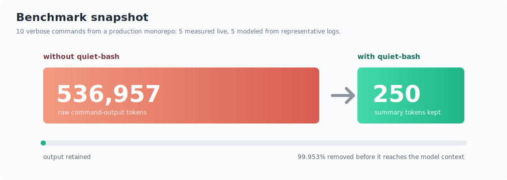
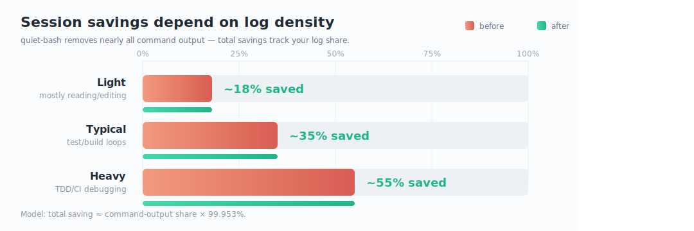

# Graph Options

The README currently uses `assets/savings-compact.svg` and `assets/workflow-context-stacks.svg`.
These alternatives are ready-to-use if you want a different visual emphasis.

## Option A: Compact Benchmark Snapshot

Use when the headline should be the strongest possible proof point:
`536,957` raw command-output tokens became `250` summary tokens.

  

## Option B: Workflow Context Stacks

Use when the audience needs to understand why total bill savings vary by
workflow. It makes the assumption visible: quiet-bash saves the log-output slice
of the session, not every token in the session.

  

## Current README Graphs

The existing graphs are still good defaults when you want a detailed command
breakdown and a simple workflow summary.

  

  

